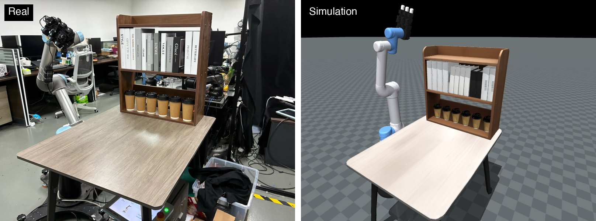
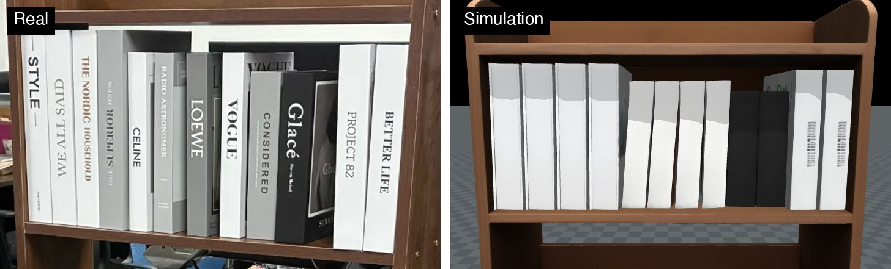
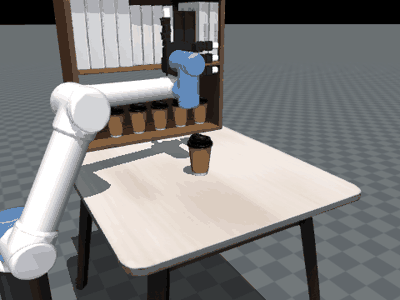
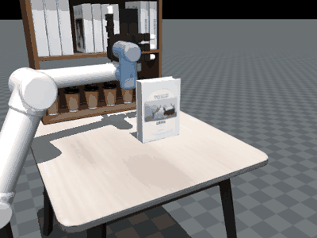
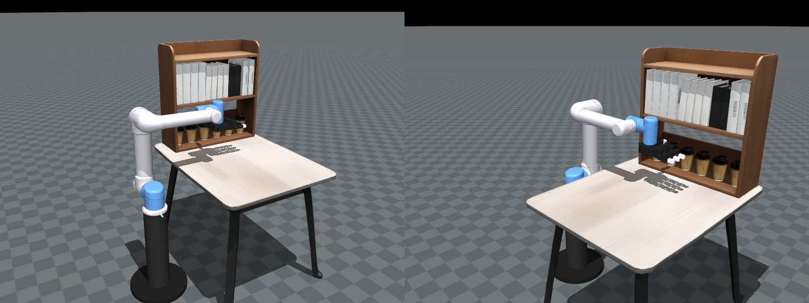
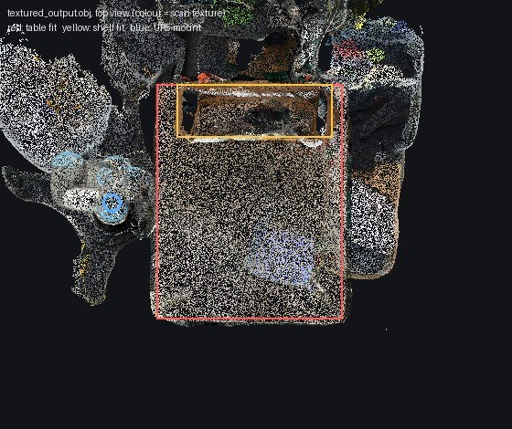

# Bookshelf scene

A MuJoCo simulation of the lab's bookshelf setup: a table with a walnut shelf holding 12 books and
6 coffee cups, and a UR5 arm with a LEAP hand on a pedestal beside it. Object meshes come from SAM3D;
real-world sizes and positions come from a phone LiDAR capture of the scene.

The package is self-contained: every input it needs is in `inputs/`, and the generated scene is
already built, so you can open it straight away.



*The real setup (left) and the simulated scene (right) from a similar viewpoint. The arm is posed
upright to match the photo.*



*The book row. Books from the same SAM3D mesh stand together and share a height: four tall, four
medium (VOGUE series), two short dark ones, two tall on the right. SAM3D doesn't reproduce the
printed spine titles.*

| Cup pick | Book pick (by the spine) |
|---|---|
|  |  |
| `python tests/grasp_test.py table`: lifts 14 cm, PASS | `python tests/grasp_test.py book`: lifts 12 cm, slips ~5 cm, PARTIAL |



*The scene in its `home` keyframe.*

## Run it

```bash
python -m venv .venv
# macOS / Linux
source .venv/bin/activate
# Windows (PowerShell)
.venv\Scripts\Activate.ps1

pip install -r requirements.txt
python view.py            # opens the viewer in the 'home' pose
python view.py ready      # or the 'ready' pose (hand in front of the shelf)
```

Scripted cup grasp (checks contacts, friction and control):

```bash
python tests/grasp_test.py table            # cup pick: prints PASS/PARTIAL/FAIL, writes tests/grasp_table.gif
python tests/grasp_test.py book             # book pick (by the spine), writes tests/grasp_book.gif
python tests/grasp_test.py table --view     # watch it live
```

On **macOS**, the live `--view` mode needs `mjpython` instead of `python` (it ships with the
`mujoco` package: `.venv/bin/mjpython tests/grasp_test.py table --view`). `view.py` works with plain
`python` everywhere.

## Rebuild from a new capture

1. Scan the scene with a phone LiDAR app that exports a zip containing `textured_output.obj` and
   `export_refined.obj` (e.g. 3D Scanner App on iPhone). Take the SAM3D reference photo in the
   same session so the layout matches.
2. Measure it and save the numbers:
   ```bash
   python tools/measure_scan.py path/to/capture.zip --write
   ```
   This writes `scan_measurements.json` (table, shelf and robot-mount dimensions in metres).

   

   *What the script fits in the capture: table (red), shelf (yellow), UR5 mount (blue).*
3. Rebuild:
   ```bash
   python build_scene.py
   ```
   It reads `scan_measurements.json` if present, re-exports all meshes into `assets/`, and rewrites
   `scene.xml` with the `home` and `ready` keyframes. Takes a few seconds.

New SAM3D meshes: drop them into `inputs/sam3d_glb/` with the same names (`table`, `shelf`, `cup`,
`book0`–`book3`), or point `SAM3D_GLB_DIR` at another folder.

Only if the LEAP hand URDF changes: `python tools/convert_leap.py`, then `python build_scene.py`.

## What's where

| Path | What it is |
|---|---|
| `scene.xml` | The MuJoCo scene (generated). Keyframes: `home`, `ready`. |
| `view.py` | Opens the viewer in a keyframe. |
| `build_scene.py` | Builds everything. Tunable constants are at the top. |
| `scan_measurements.json` | Measured dimensions from the capture (overrides defaults in `build_scene.py`). |
| `tools/measure_scan.py` | Measures table, shelf and UR5 mount from a capture zip or mesh. |
| `tools/convert_leap.py` | Converts the LEAP URDF to MJCF with actuators. |
| `tests/grasp_test.py` | Scripted cup and book grasp tests. |
| `docs/images/` | Images and animations shown in this README. |
| `assets/` | Generated meshes, textures and robot models used by `scene.xml`. |
| `inputs/sam3d_glb/` | SAM3D meshes (unit-scaled, Y-up). |
| `inputs/robots/` | UR5 source model and LEAP hand URDF. |
| `inputs/reference_photo.webp` | The photo the book order, book heights and cup count were read from. |

## Scene facts

- World frame: origin on the floor under the table center, +Y toward the shelf, +Z up, metres.
- 22 actuators: `ur5_*` (6 arm position servos) and `ur5_leap_a0` to `a15` (hand, 0 = open).
- Collision: table and shelf use box panels (compartments stay open); cups and books use the convex
  hull of their mesh; the arm uses one hull per link; the hand uses its URDF boxes plus rubber tips.
- Runs at roughly 9 to 17x real time on a laptop (2 ms timestep).

## Known limits

- The LEAP mount on the flange (`HAND_MOUNT_POS`, `HAND_MOUNT_EULER` in `build_scene.py`) and the
  robot base yaw are not measured. Object masses (cup 50 g, book 300 g) are estimates.
- The UR5 cannot reach the cups on the bottom shelf board without hitting the table
  (`tests/grasp_test.py shelf` reports this). Worth checking against the real robot.
- In the viewer, don't click **Save key** or **Load key** while the Key field shows -1; MuJoCo
  aborts. Set Key to 0 (`home`) or 1 (`ready`) first.

## Licenses

- LEAP hand model: MIT (`inputs/robots/leaphand_urdf/LICENSE.txt`, copied to `assets/leap_hand/`).
- UR5 model: taken from OpenReal2Sim's robot assets; check that project's license before
  redistributing outside the lab.
